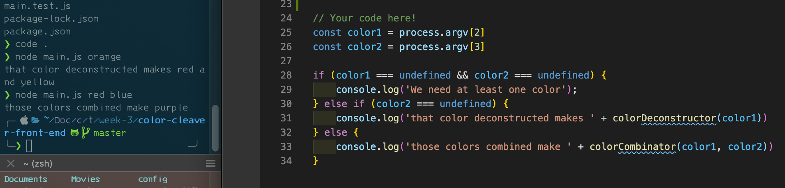
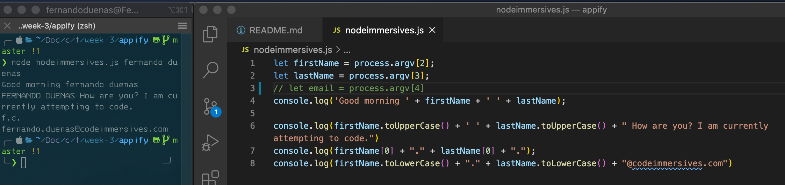
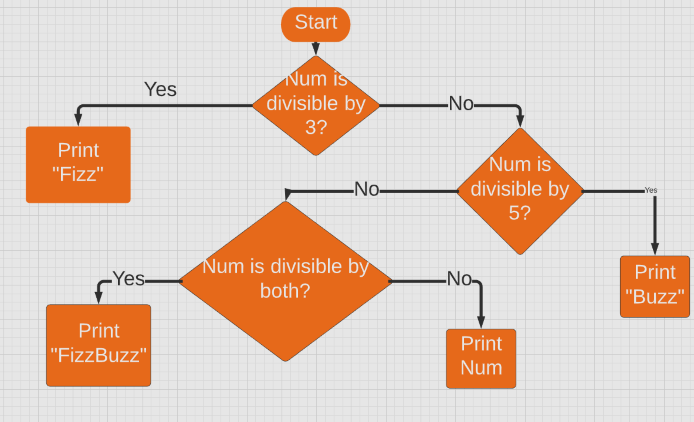
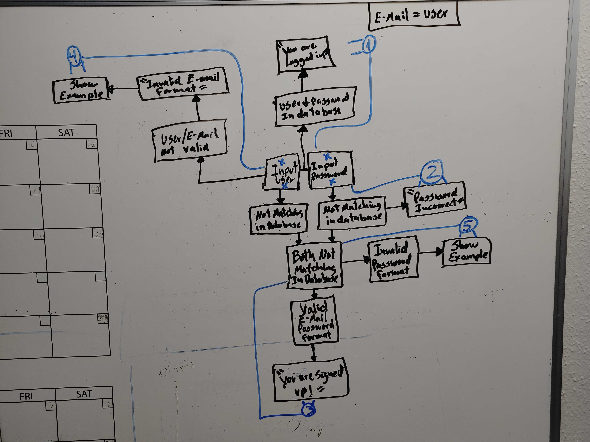

# WHAT-I-LEARNED-IN-WEEK-3


## 🎢 Hoisting :
Hoisting is JavaScript's default behavior of moving all declarations to the top of the current scope (to the top of the current script or the current function).<br>
For example:<br>

* This wont work ⇲<br>
```javascript
console.log(a + b); //ReferenceError: a is not defined
                    // ReferenceError: Cannot access 'a' before initialization
let a = 2;

let b = 2;
```
As you can see in the example above we are `console.log`-ing before we declare the variables and that will not work.<br>


* This will work ⇲<br>
```javascript
example(2, 2); // result: 4

function example(a, b) {

    return a + b;
}
```
As you can see on this example above we called the `function example` before the function and we were still able to run what was inside the function.<br>

---

## 🕸 `Code` De`bug`ging 🕸<br>
Programming code might contain syntax errors, or logical errors.<br>
Many of these errors are difficult to diagnose.<br>
Often, when programming code contains errors, nothing will happen. There are no error messages, and you will get no indications where to search for errors.<br>
Searching for and fixing errors in programming code is called `code debugging`.<br>
We are going to take a closer look on how to debug in VSCode. It is simple to do, however it could be a little confusing at first.<br>
Here below is a `gif` file showing in a few steps how to debug a simple function ⇲<br>


[Click here to find more information about `VS-Code debugging`](https://code.visualstudio.com/docs/editor/debugging)

---

## ♺ Node.js `process.argv` property ♺<br>
The process.argv property is an inbuilt application programming interface of the process module which is used to get the arguments passed to the node.js process when run in the command line.<br>

This property returns an array containing the arguments passed to the process when run it in the command line. The first element is the process execution path and the second element is the path for the js file.<br>



As you can see in the left hand side of the screenshot above. There is a terminal displaying a couple of commands invoking `node main.js red blue`.<br>
Pretty much this command is inputting the colors to the code in the right hand side. You can see those two constants `color1` and `color2` both with `process.argv[]`property and the square brackets enclosing and index number which will invoke the previous mentioned colors `red` and `blue`. Here Below I will show how this terminal command is looked at as an array ⇲<br>

|   0   |   1   |   2   |   3   |
| :---: | :---: | :---: | :---: |
| node  |main.js|  red  |  blue |

This is basically this ⇲

```javascript
[0, 1, 2, 3]
```
These are 4 indices in an array, always starting with the number `0`, which is the execution path, number `1`, which is the path for the `js` file, follow by `2` and `3`, which will be the colors invoked in the command line.<br>

Here below is one more screenshot showing one of out pair-programming projects ⇲<br>



It shows how we are able to concatenate the first and last name with the server and domain name. It was a pretty neat project with node.js.<br>

---

## 🌊 Flow charts 🏄‍♂️

Here below is a flowchart, which it looks presentable, however the flow of the code is not exactly correct ⇲<br>

[This is the link to the wrong flow chart from slack.](https://slack-files.com/T01AQT1MFCH-F01BTUHB19A-20e89475bf)

The good thing about this is to picture the flow of your code in order to have a broad display of your idea.<br>

> ( ***On a side note***. I tried to use a links from slack showing this picture above, but I was not able to do, so I had to download the picture in order to display it. There seems to be some sort of limitation with slack link, similarly with google drive shared pictures.<br>
I thought it would be a good point to make since that's what we do... Explore. )

Going back to the topic. Here below is a flow chart I made. It is not the greatest and it does not follow the right techniques of a flow chart, however, it was able to let me see the big picture of my code ⇲<br>



The blue lines are not loop lines. They are there just to reference the instruction number that were given to us.<br>
I tried to do my code without a flow chart and I've noticed I was forgetting the previews steps and I was getting slightly confused and spending more of my time going back to the beginning of my code. Then I decided to do the flowchart and it was a lot easier to actually see the flow of my logic and by the time I had to code it, it was very easy to do so.

---

